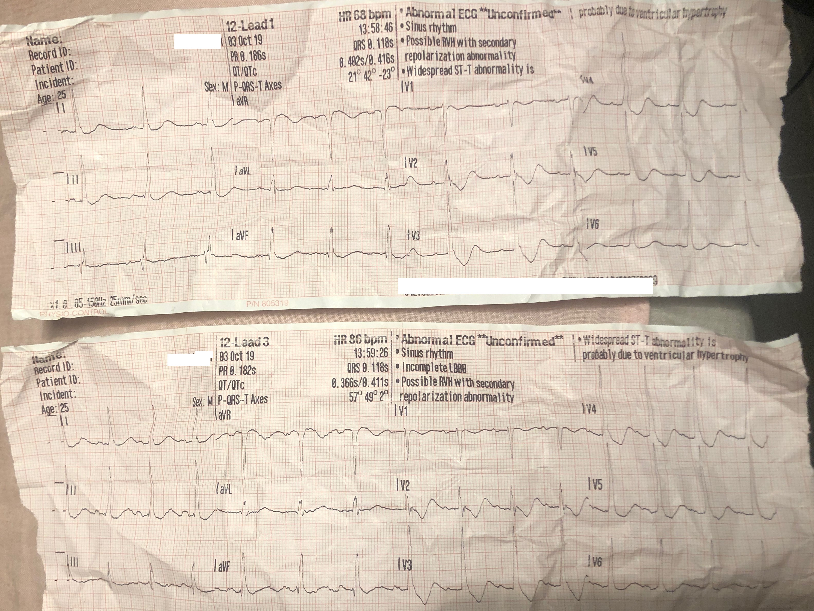

# Progressive weakness

This case study analyses a case of progressive weakness in a 25 year old male. The initial call was a 2B - sick person. The caller statement was: "Son is sick". No further information was provided. The caller was NESB so information was limited. It was a particularly busy day and the patient had been waiting roughly 5 hours for an ambulance to arrive. 

## On arrival at the residence

The patient was situated in a town house in his bedroom, up a narrow winding staircase. Initial impression:

1. Airway - patent
2. Breathing - present
3. Circulation - Radial pulses, pink and warm
4. Disability - GCS 15
5. Exposure - Warm summers day, nil concerns

## History of presenting illness

The patient states to paramedics that he has been having a roughly 1 month history of progressive weakness in his lower limbs. He states difficulty walking up and down the stairs, increased weakness in the gym. Pt denies any issues with upper limb strength in the previous month. 

He further states that he had a rapid increase in weakness in the past 24 hours. The weakness had progressed slowly to his upper limbs. At the time of assessment the patient was able to lift his head from the bed, flex his arms very slightly, and had nil ability to lift his legs. He had bilateral grip strength, which was weak. Bilateral foot extension/flexion which was also weak. 

The patient denies recent illness, nausea, vomiting, diarrhoea, headaches, visual disturbance, chest pain, SOB. The patient denies any trauma. C-spine non-tender. 

He reports being able to walk to the toilet in the early morning, although unable to move at all at time of assessment. 

He has a PmHx of Asthma which he takes Ventolin for. Denies Allergies.

**Observations**

1. HR: 68
2. RR: 14
3. BP: 135/89
4. TEMP: 36.6
5. BSL: 6.8
6. GCS: 15
7. Pupils: PEARL 4mm

**ECG**

The ECG is poor quality as I forgot to scan it at the time, although it paints a picture of the underlying diagnosis.

## Treatment

**Treatment provided**

1. IV access - 20g RCF
2. Reassurance

At the time, we had no working diagnosis. The treatment that was provided was supportive. Monitoring airway, breathing and circulation for any changes in condition. 

## Discussion

This case study looks at the presentation of a 25 year old healthy male who presented with a progressive weakness starting in the lower limbs. At the time, I had no idea what was wrong with the patient. He had no traumatic cause of weakness, nor a significant history to suggest a cause of his paralysis. 

There is a glaringly obvious cause for his paralysis, which I missed at the time. If you look at his ECG there is the presence of widespread ST depression and T-wave inversion with the presence of U waves. A pseudo presence of a long QTc due to the fusion of the T and U waves. This is a classic representation of Hypokalaemia. 

!!!info "Hypokalaemia"
	Severe hypokalaemia can lead to paralysis, particularly in extreme cases where potassium levels are critically low. This paralysis may affect respiratory muscles, leading to respiratory failure.   Severe hypokalaemia can also result in muscle cramps, supra/ventricular arrhythmias, rhabdomyolysis, and myoglobinuria. Rhabdomyolysis results from muscle fibers breaking down and releasing their contents into the bloodstream, leading to kidney damage and potentially life-threatening complications. [Reference](https://www.ncbi.nlm.nih.gov/books/NBK482465/)

The patient was transported to hospital, where he was discovered to have a K^+^ level of  1.2 mmol/L. This is considered severe-life threatening Hypokalaemia. 

### PEARLS

Clinical symptoms of hypokalaemia are usually only noticeable once the serum potassium is less than 3 mmol/L. 

Potassium is the predominant intracellular cation, responsible for cellular regulation and process. Potassium is responsible for maintaining cellular membrane potential, nerve impulse conduction, muscular function, and acid-base balance.

Potassium is essential for the normal function of muscles. Decreased potassium levels can disrupt neromuscular transmission and decrease muscle contraction. 

Hypokalaemia manifests as an ascending paralysis, with lower extremities developing profound weakness before progressing to the trunk and upper extremities. There is inherent risk of hypokalaemia affecting the respiratory muscles. 

Hypokalaemia has an extensive effect on the cardiac system. Patients with severe hypokalaemia are at inherent risk of atrial tachycardia's, ventricular arrhythmias and Torsades de Pointes. This is because hypokalaemia is associated with hypomagnesia. 

## Overview

Overall, this case was of great interest as I had not identified the obvious signs for the patients condition. The condition that had presented was significant and could of had drastic effects on the patients condition. In hindsight, I would be able to identify the severity of the patients condition and act appropriately. 

Transport to hospital with a pre-alert would be appropriate as timely assessment and treatment of hypokalaemia will prevent further deterioration or progression into respiratory distress/ventricular arrhythmia. 

Early identification of hypokalaemia can greatly impact your patients outcome.
## References

1. [https://www.ncbi.nlm.nih.gov/books/NBK482465/](https://www.ncbi.nlm.nih.gov/books/NBK482465/)
2. [https://litfl.com/hypokalaemia-ecg-library/](https://litfl.com/hypokalaemia-ecg-library/)
3. [https://ec.bioscientifica.com/view/journals/ec/7/4/EC-18-0109.xml](https://ec.bioscientifica.com/view/journals/ec/7/4/EC-18-0109.xml)
4. [https://www.nature.com/articles/nrneph.2010.175](https://www.nature.com/articles/nrneph.2010.175)