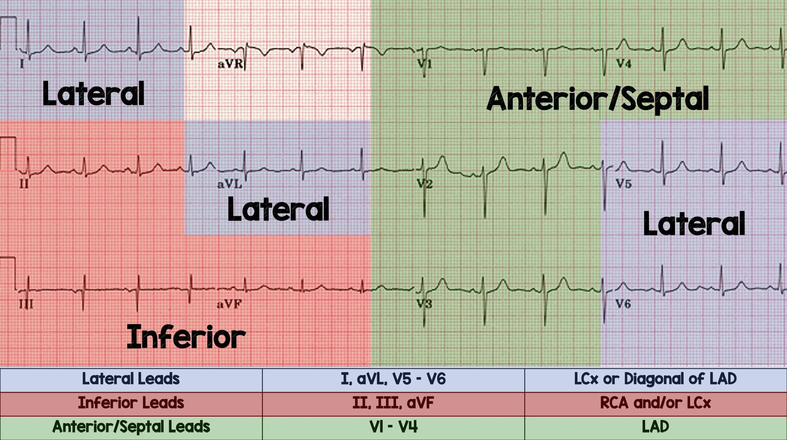
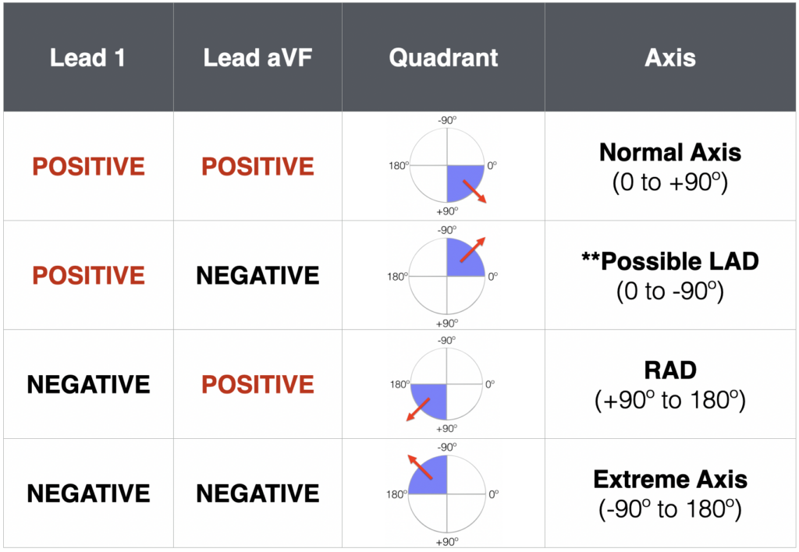
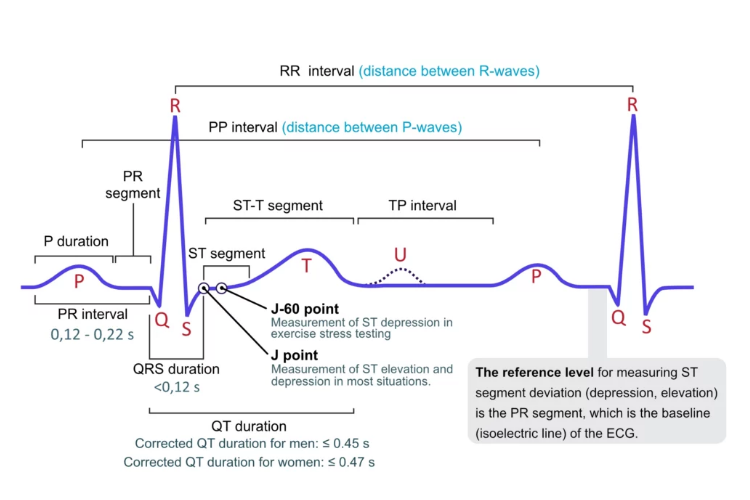

# ECG Basics

Electrocardiogram (ECG) interpretation is a crucial skill in the field of emergency medicine. An ECG provides a graphical representation of the electrical activity of the heart, offering invaluable insights into its rhythm, rate, and overall function. While the basics of ECG interpretation can be grasped with dedicated study, achieving mastery requires time, practice, and a deep understanding of cardiac physiology. At its core, ECG interpretation involves recognising and analysing key components such as the P wave, QRS complex, T wave and the various intervals and segments. These elements correspond to different phases of the heart's electrical cycle and can indicate normal function or various pathologies. Fundamental knowledge of these basics is essential for identifying common conditions such as arrhythmias, myocardial infarctions, and electrolyte imbalances. Remember, the journey to becoming proficient in ECG interpretation is a marathon, not a sprint. With patience and continuous learning, you can develop the expertise needed to make accurate and life-saving diagnoses.

---

## Anatomy of the ECG

The anatomy of the ECG can be complex. There are various leads that look at different electrical vectors of the hear. Furthermore, the nitty gritty anatomy of the ECG involves investigating the various waves, complexes, segments, intervals and axis. I hope to make this easy for you to understand and remember. 

## Axis interpretation

Axis interpretation is an important aspect of ECG interpretation. Although not widely thought about, it forms a vital part of ECG interpretation, especially when diagnosing ventricular arrhythmias, think SVT vs VT. I wont go to much into axis interpretation, although I will touch on it a little bit. Many conditions can affect ECG axis, such as COPD, PE, STEMI, etc. 

The ECG axis is measured in degrees and a normal axis is between -30&deg; and +90&deg;. Working out the axis can be done with a few different methods. the quadrant method is the simplest method. It involves figuring out if lead 1 and lead aVF are either positive, negative, or equiphasic. 

Using the table below is the simplest way to work out a quick ECG axis. 

Use this table as a reference for axis deviation. It will be very handy when we cover SVT vs VT.

## ECG Waveforms

### P wave, PR interval and PR segment

The P wave, PR interval and PR segment are measurements of atrial origin of depolarisation. The P wave directly represents atrial depolarisation where as the PR interval is a measurements of whether the impulse conduction from the atria to the ventricles is normal. The PR segment is a measure of conduction through the AV node. 

Having upright P waves, represents true atrial depolarisation, originating from the SA node. A normal PR interval, represents normal depolarisation of the atrial, and no focal or multifocal stimulus is present. 

The PR interval is measured in milliseconds. A normal PR interval is between 0.12ms - 0.22ms or < 1 large box on the ECG.

Inverted P waves can be present in rhythms originating from outside the SA node, for example - [Junctional rhythms](https://litfl.com/accelerated-junctional-rhythm-ajr/) or focal/multifocal [atrial tachycardia](https://litfl.com/atrial-tachycardia-ecg-library/) or [wandering atrial pacemaker](https://www.healio.com/cardiology/learn-the-heart/ecg-review/ecg-topic-reviews-and-criteria/wandering-atrial-pacemaker-review)
## QRS Complex

The QRS complex represents ventricular depolarisation. The QRS is typically narrow which represents rapid depolarisation of the ventricles, unless some form of conduction defect/dysfunction is present. 

The normal duration of the QRS is <0.12ms

## ST Segment and J point

The ST segment represents phase 2 (Plateau) phase of the cardiac action potential. This is important to understand for ECG interpretation. The ST segment can be altered in a wide variety of conditions. The ST segment can be depressed, or elevated in myocardial infarction/ischemia, lengthened in electrolyte disorders or drug toxicity. 

A thorough understanding of ST segment elevation and depression should be appreciated by all clinicians. ST segment elevation >1mm in the precordial leads

## Stepwise Approach

- [https://litfl.com/ecg-axis-interpretation/](https://litfl.com/ecg-axis-interpretation/)
- [https://litfl.com/vt-versus-svt-ecg-library/](https://litfl.com/vt-versus-svt-ecg-library/)
- [https://ecgwaves.com/topic/ecg-normal-p-wave-qrs-complex-st-segment-t-wave-j-point/](https://ecgwaves.com/topic/ecg-normal-p-wave-qrs-complex-st-segment-t-wave-j-point/)
- [https://litfl.com/st-segment-ecg-library/](https://litfl.com/st-segment-ecg-library/)