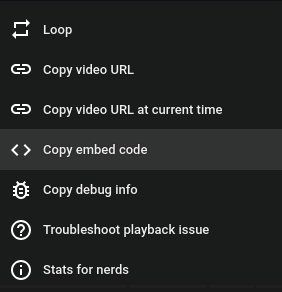

# Markdown Guide

All pages on the website are written using markdown. Markdown is a lightweight markup language created for formatting text. 

Below is a basic guide on how to write a topic/case study using markdown. 

---
# Headings

Headings are denoted using the `#` character before the word you want to use as a heading. 

For example: `# Headings` is a H1 heading and will be the largest heading on the page. It will also be the top most heading in the table of contents on the left. For example, if I was to use 

```
# heading 1
some text 

## heading 2
some text 
```

that would result in the table of contents as:

```
Heading 1
   Heading 2
     Heading 3
       Heading 4
```

This is extrapolated for all heading types. Below is a list of all heading types:

```
# Heading 1
## Heading 2
### Heading 3
#### Heading 4
```


# Heading 1
## Heading 2

### Heading 3

#### Heading 4

---
# Line breaks

Sometimes you want to split up the content of a paragraph. This can be achieved by putting the `<br>` symbol where you want a line to break. 

For example: 

**Without line break**:

This text does not have a line break in it and the contents of the paragraph will wrap at the screen edge.

**With line break**:

This text does have a line break `<br>` <br> in it and the contents of the paragraph will break `<br>` <br> onto a new line.

---

# Images

Images can be embedded into you write up by using the syntax ``. It is important that you include the `!` before the bracket to ensure the image is embedded properly. There is no need for the `"` to be included, this is just to show you an example. 

For example: `` would look like


---

# Video

Embedding videos is possible with markdown

You will have to use a HTML `<iframe>` which will embed the video into your write up. 

```html

<iframe width="700" height="500" src="https://www.youtube.com/embed/_PPWWRV6gbA" title="The Only Markdown Crash Course You Will Ever Need" frameborder="0" allow="accelerometer; autoplay; clipboard-write; encrypted-media; gyroscope; picture-in-picture; web-share" referrerpolicy="strict-origin-when-cross-origin" allowfullscreen></iframe>

```

will equal:

<iframe width="700" height="500" src="https://www.youtube.com/embed/_PPWWRV6gbA" title="The Only Markdown Crash Course You Will Ever Need" frameborder="0" allow="accelerometer; autoplay; clipboard-write; encrypted-media; gyroscope; picture-in-picture; web-share" referrerpolicy="strict-origin-when-cross-origin" allowfullscreen></iframe>


You can get a generated iframe from YouTube by right clicking a video and clicking `Copy embed URL` in the context menu.




---

# Links 

Links are similar to images. The syntax for a link is `["name to display"]("Link to website")` for example: `[Markdown Guide](https://www.markdownguide.org/basic-syntax/)` would look like [Markdown Guide](https://www.markdownguide.org/basic-syntax/)

---

# Emphasis

You can make text bold or italic by adding the `*` symbol around words.<br>For example: `**Bold text**` would be **Bold text** and `*Italic text*` would be *Italic text*.

To underline a particular word or sentence you would add `^^` symbols around the word. 
Example:<br><br> `^^Underline^^` would equal ^^Underline^^<br>`^^**Bold Underline**^^` would equal ^^**Bold Underline**^^<br>`^^*Italic underline*^^` would equal ^^*Italic underline*^^

Emphasis can be used in headings and links. For example:

`[^^**I am a bold and underlined lined link**^^](#Emphasis)` Would equal:<br> [^^**I am a bold and underlined lined link**^^](#Emphasis)<br>

Or `# ^^Underlined heading^^` would equal:
# ^^Underlined heading^^


---

# Blockquotes

Blockquotes are a way to emphasis a point or inlude a quote in your write up.
Blockqoutes are denoted using the `>` symbol before a sentence


for example `> I am a blockquote`:

> I am a blockquote

Blockquotes can be multiline as well:

```
> I am a block quote
> 
> I am also a blockquote 
> 
> I am a block quote too
```

> I am a block quote
> 
> I am also a blockquote 
> 
> I am a block quote too

Blockquotes can be multi-level too:

```
> I am a block quote
> 
>> I am also a blockquote 
> 
>>> I am a block quote too
```

> I am a block quote
> 
>> I am also a blockquote 
> 
>>> I am a block quote too

Blockquotes can contain other items:

```
> ## Blockquote heading
> I am just text
> - list item 1
> - list item 2
> **I am bold text** in a *sentence*

```

> ## Blockquote heading
> 
> I am just text
> 
> - list item 1
> - list item 2
> 
> **I am bold text** in a *sentence*


---

# Admonitions

Admonitions are a great way to highlight details or important information

For example: 

```
!!!warning "Name of # Admonitions"
	Text must be indented by 1 tab space to appear in the Admonitions
```

!!!warning "Name of Admonitions"
	Text must be indented by 1 tab space to appear in the Admonitions

Admonitions can have a title which is denoted between the `""` symbols, or if left blank, will have no title:

!!!warning ""
	Text must be indented by 1 tab space to appear in the Admonitions<br>The title has been left blank - so the admonition has no name!

**Collapsed admonition**

Admonitions can be made collapsible by using the `???` symbol instead of `!!!`:

```
???warning "This is collapsible"
	Text must be indented by 1 tab space to appear in the Admonition
```

???warning "This is collapsible"
	Text must be indented by 1 tab space to appear in the Admonition
	
**Expanded admonition**

Admonitions can be made expanded by using the `+` with the `???` like `???+`:

```
???+ "This is collapsible but expanded"
	The admonition is expanded by default by using the `+` symbol after `???` like: `???+`
```

???+ "This is collapsible but expanded"
	The admonition is expanded by default by using the `+` symbol after `???` like: `???+`

**Typed of admonitions**

!!!note "Note"
	Note
	
!!!warning "Warning"
	Warning

!!!danger "Danger"
	Danger

!!!info "Info"
	Info

!!!tip "Tip"
	Tip

!!!question "Question"
	Question
	
!!!quote "Quote"
	Quote

--- 

# Markdown editors

Markdown editors make it easy to see what your markdown is doing when you write it. I personally use [Obsidian](https://obsidian.md/) although there are many editors out there. 

???tip "Markdown Editors"

	=== "Obsidian"
		Obsidian is a feature rich markdown text editor. It allows you to preview what you write in real time as you type and has many plugins and extensions to make writing markdown easier. <br>[Get Obsidian](https://obsidian.md/)
		
	=== "Drafts"
		Drafts is a markdown editor for iPadOS which is free and easy to use.<br>[Get Drafts](https://apps.apple.com/us/app/drafts/id1236254471)
		
	=== "MarkText"
		A simple and elegant open-source markdown editor that focused on speed and usability. It is feature rich and has real time preview so you can see the formatting of what you're typing.<br>[Get MarkText](https://www.marktext.cc/)
	=== "More"
		- [Bear](https://bear.app/)
		- [Boost Note](https://boostnote.io/)
		- [Joplin](https://joplinapp.org/)