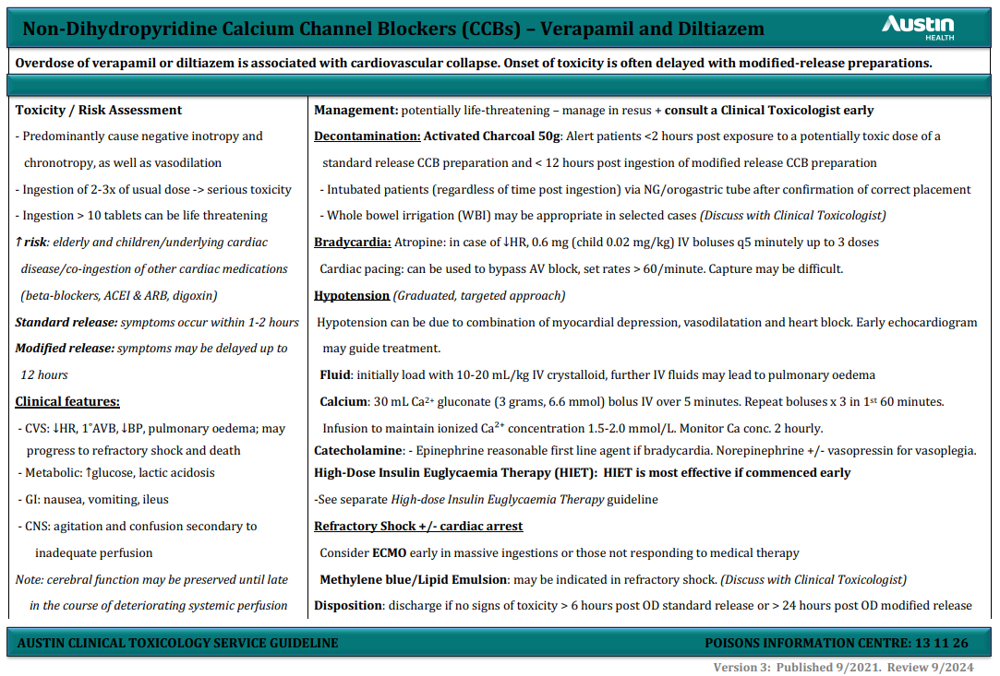

# Calcium channel blockers (CCB)

## Preface

CCBs are widely used in anti-hypertensive therapies. In overdose, CCB's exhibit a profoundly toxic effect. Acting to block calcium uptake in the myocardium and vascular smooth muscle, toxicity can quickly lead to cardiovascular collapse and death. 

## Mechanism of action

CCBs are can classed as dihydropyridine and non-dihydropyridine types. All CCBs inhibit voltage-gated L-type calcium channels in the myocardium and vascular smooth muscle. Voltage-gated calcium channels are responsible for for excitation-contraction coupling of skeletal, smooth, and cardiac muscles. Blockade of calcium influx therefore directly decreases vascular smooth muscle and cardiac muscle contraction. They also play a large role in the conduction of cardiac pacemaker signals. At therapeutic doses, dihydropyridine's are selective for blood vessels, where as non-dihydropyridine's act both on reducing vascular contraction (peripheral resistance) and have specific effect on cardiac tissue. Non-dihydropyridine's further depress myocardial contractility, reduce sinus node firing rate and AV-node conduction.

 *Dihydropyridine*s

 - nifedipine
 - felodipine
 - Amlodipine

*Non-Dihydropyridines*

- diltiazem
- verapamil

Non-Dihydropyridines are the most lethal CCBs due to their non-selective nature, although dihydropyridines loose receptor selectivity in large overdose. The coformulation trandolapril (ACE inhibitor) + verapamil will have profound effects as congestion will potentiate the effects of overdose.
## Clinical presentation

**Cardiovascular**

- Sinus bradycardia, conduction delays (First-degree heart block, junctional and idioventricular rhythms)
- Hypotension due to bradycardia, myocardial depression and vasoplegia
- Cardiogenic shock
- Pulmonary oedema

**CNS**

- Drowsiness
- Confusion
- Agitation
- Seizure

**Metabolic**

- Hyperglycaemia
- Acidosis

*Onset of symptoms*

- **Immediate-release formulations**: Symptoms typically occur within 1-2 hours of ingestion
- **Extended-release formulations**: Symptoms may be delayed, occurring up to 12-24 hours after ingestion

## Prehospital Management

## References

1. [CCBs - Australia Prescriber](https://australianprescriber.tg.org.au/articles/calcium-channel-antagonists.html)
2. [CCB poisoning - Therapeutic guidelines](https://tgldcdp.tg.org.au.acs.hcn.com.au/viewTopic?etgAccess=true&guidelinePage=Toxicology%20and%20Toxinology&topicfile=toxicology-dihydropyridine-calcium-channel-blocker&guidelinename=Toxicology%20and%20Toxinology&sectionId=toc_d1e47#toc_d1e47)
3. [Calcium Channel Blocker Toxicity - LITFl](https://litfl.com/calcium-channel-blocker-toxicity/)
4. [Austin Clinical toxicology guidelines](https://www.austin.org.au/page?ID=1791)
5. 